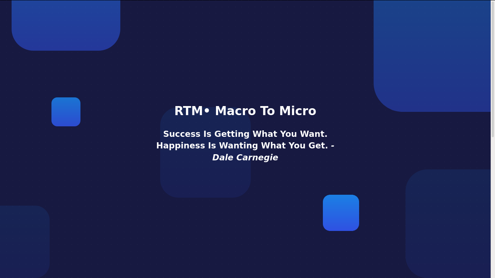
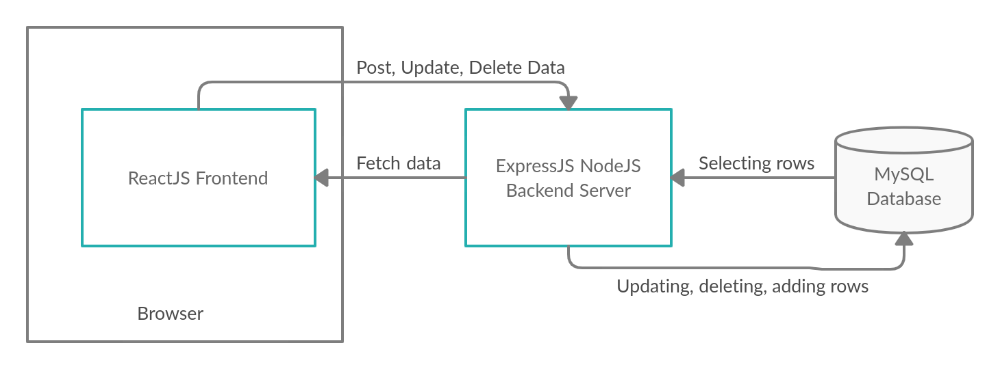
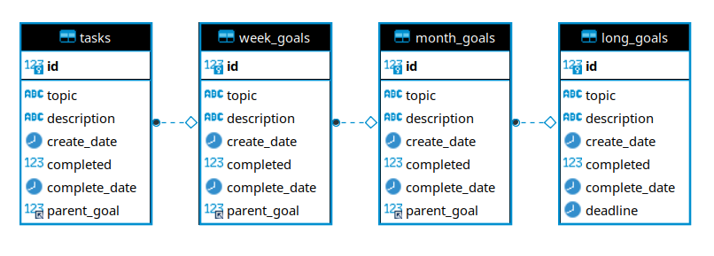
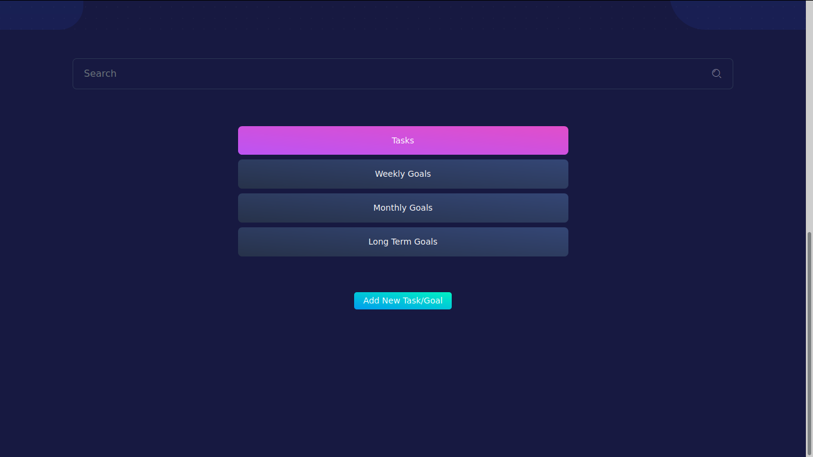
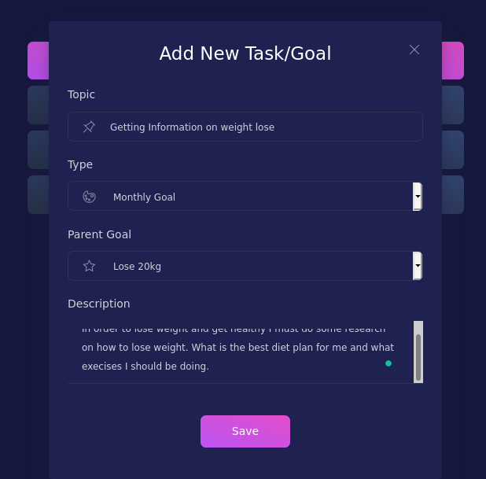
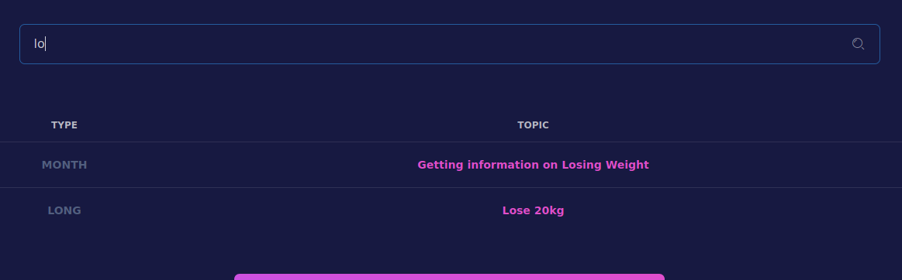
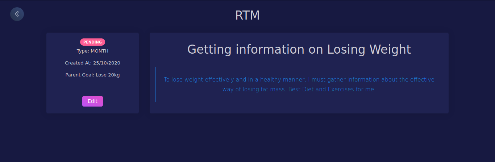
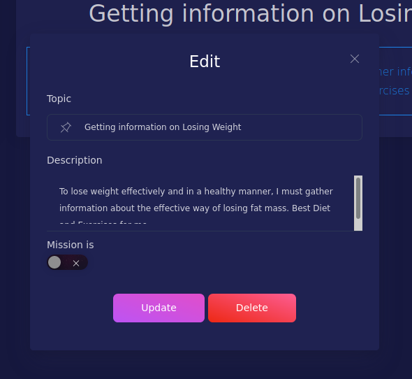
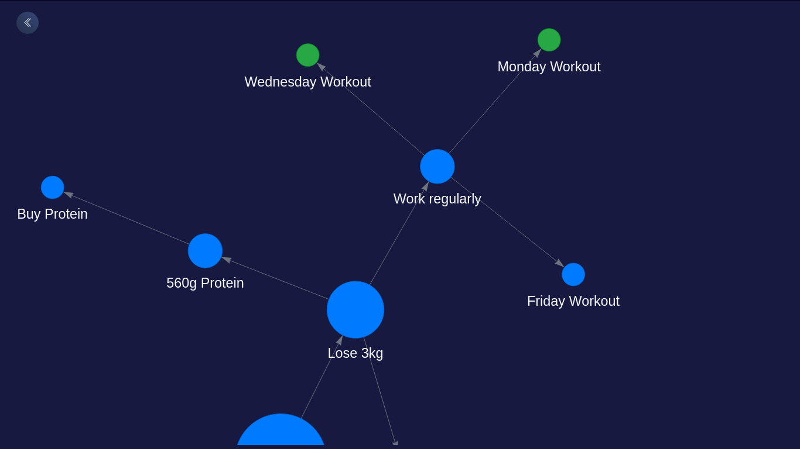

## **Real Task Manager**

### Raspberry Pi | NodeJS | ReactJS | ExpressJS | MySQL

**─**

## **Introduction**

**Real Task Manager (RTM) is a web application hosted on a Raspberry Pi made to organize goals and tasks**. Its design guides the user to break down each goal into smaller and smaller sections until it is doable in a short period.

It achieves this by having 3 categories of goals, namely, Long Term Goals, Monthly Goals and Weekly Goals, and one category for daily tasks. Users first must create a bigger goal before creating any smaller ones. This gives an implicit direction to each task/goal (a.k.a mission in this project).

MSP of the project is that it is on a Raspberry Pi 3 B+, hence it is extremely portable. This system does not even require an internet connection. All it needs is a modern smartphone and access to an electricity socket. Users have to just turn on the hotspot on their mobile device and plug Raspberry Pi into the socket. 

The application also gives an option to visualize their missions. Presently, almost everybody has too many things happening in their lives, this feature gives **a dynamic graph of goals and tasks and how they are connected.**





## **Technical Details**

RTM is made using **Raspberry Pi, ReactJS, NodeJS, ExpressJS, and MySQL**.


[RTM-Client (ReactJS)](https://github.com/VandanRogheliya/RTM-Client)

[RTM-API (NodeJS - ExpressJS)](https://github.com/VandanRogheliya/RTM-API)


### Block Diagram





### ER Diagram





### API

RTM’s API is made using NodeJS and ExpressJS


#### Requests are made to the following endpoints


*   ‘/tasks’ -> GET, POST, DELETE Operations supported
*   ‘/tasks/:id’ -> GET, PUT, DELETE Operations supported
*   ‘/week-> GET, POST, DELETE Operations supported
*   ‘/week/:id’ -> GET, PUT, DELETE Operations supported
*   ‘/month’ -> GET, POST, DELETE Operations supported
*   ‘/month/:id’ -> GET, PUT, DELETE Operations supported
*   ‘/long’ -> GET, POST, DELETE Operations supported
*   ‘/long/:id’ -> GET, PUT, DELETE Operations supported


#### SQL queries made using Goal class

The project contains very similar tables. To use that to an advantage, while developing a Goal class was made which generalizes the process of communicating with the database. In other words, **the code becomes DRY hence easier to maintain**. The SQL queries doing the same function are generalized.


```

Goal.create = (newGoal, result, table) => {
 sql.query(`INSERT INTO ${table} SET ?`, newGoal, (err, res) => {
   if (err) {
     console.log('error: ', err)
     result(err, null)
     return
   }

   console.log(`created ${table}: `, { id: res.insertId, ...newGoal })
   result(null, { id: res.insertId, ...newGoal })
 })
}
```


In the example above, it can be seen how one function `Goal.create(newGoal, result, table)` can be used for all the tables. The developer has to only use the right parameters to interact with a particular table.


### Client

The entry point of the RTM client is ‘App.js’. In this file, all the missions are fetched first and then the page is rendered. All missions are fetched to enable quick search functionality. It conditionally renders either the Home.js component or Mission.js component.

Home.js component is where goals/tasks can be searched and opened. Also, new missions can be added from this view.

When goal/task is clicked on, Home.js is unmounted and Mission.js is mounted. The type and the id of the mission are passed to the Mission.js component as props. In this component, the mission can be edited or deleted too.


## **Screen Shots**


### Home.js





### Adding Mission





### Searching





### Mission View





### Edit form




### Visualization





## **Why I chose to build this**


1. I am a Goal-Oriented Person

    I like to make my dreams concrete and well defined. I have found this works very well for me. So by making this project it will help me manage all my long term goals. RTM will also provide a sense of purpose with each task I make, as it has to be connected with a bigger goal.

2. Distraction Free

    As I already stated in Objective, the MSP of this project is that it is hosted on a Raspberry Pi and it does not require an internet connection. We all know the internet is filled with distractions, I prefer to avoid it when I am trying to be productive. Moreover, due to the lack of internet, there is zero possibility of ads.

3. Faster Development of full-stack web apps

    I am a full stack web developer in my part-time. While developing an application it usually involves making a backend first and then a frontend. While testing the frontend, I have to run both these things on my laptop. This slows down the development process quite a lot because of the slow laptop. This project also serves as proof of concept to me that I can deploy my backend to the Raspberry Pi after it is ready and divide the load.


## **Functionalities**


*   Database operations: Adding, Deleting, Updating, and  Querying Missions
*   Form validation and error handling
*   Searching capabilities
*   **Visualizing Missions and how they are inter-connected with an interactive graph**
*   **Portability of RTM**. Requires only a hotspot and power source.
*   Plug and play. No extra setup is required on start-up. **Just power up the Raspberry Pi and the server starts running.**
*   **Responsive Design**. Works on any screen size.
*   Random Motivational Thought Generator


## **References**

[Reactstrap Documentation](https://reactstrap.github.io/)

[ReactJS Documentation](https://reactjs.org/docs/getting-started.html)

[ExpressJS Documentation](https://expressjs.com/)

[MySQL and ExpressJS Connection Blog](https://bezkoder.com/node-js-rest-api-express-mysql/)

[React-Graph-vis](https://www.npmjs.com/package/react-graph-vis) 

[Raspberry Pi NodeJS](https://blog.cloudboost.io/how-to-run-a-nodejs-web-server-on-a-raspberry-pi-for-development-3ef9ac0fc02c)
